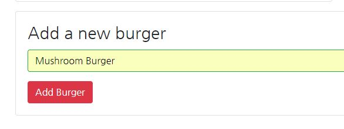
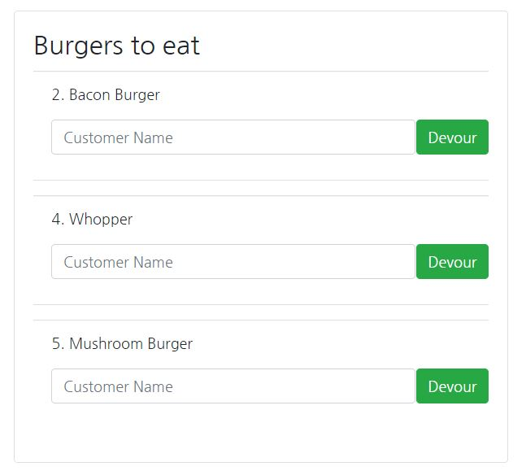
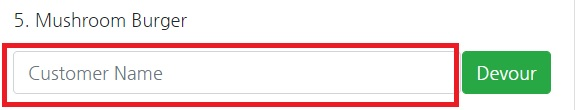
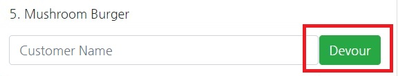
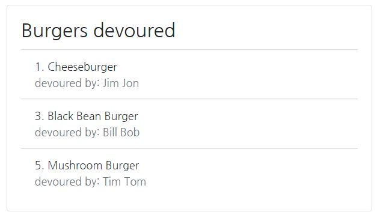

# Eat Da Burger

This is a mobile friendly burger logger built with MySQL, Node, Express, Handlebars, Bootstrap, JQuery and Sequelize. This application follows the MVC design pattern. Node, MySQL, and Sequelize are used to query and route data into app, and Handlebars is used to generate the HTML.

* `Eat Da Burger` is a restaurant app that lets users input the names of burgers they'd like to eat.
* Whenever a user submits a burger's name, the app will display the burger on the `Burgers to eat` area waiting to be devoured.
* Each burger in the `Burgers to eat` area also has a `Devour` button. When the user clicks it, the burger will move to the `Burgers devoured` area.
* The app will store every burger in a `mySQL` database.

The deployed application can be found [here](https://noel-eat-burger-sequel.herokuapp.com).

## To add a new burger

1. Enter the name of the burger you would like to add in the `Add a new burger` section and hit the enter key or `Add New` button.

    

2. You should see the new burger added to the `Burgers to eat` section.

    

## To eat a burger

1. Enter the `customer name` that will be eating the burger. 

    

2. Press the `devour` button. 

    

3. When the `devour` button is pressed the burger will move from the `Burgers to eat` section to the `Burgers devoured` section.

    

